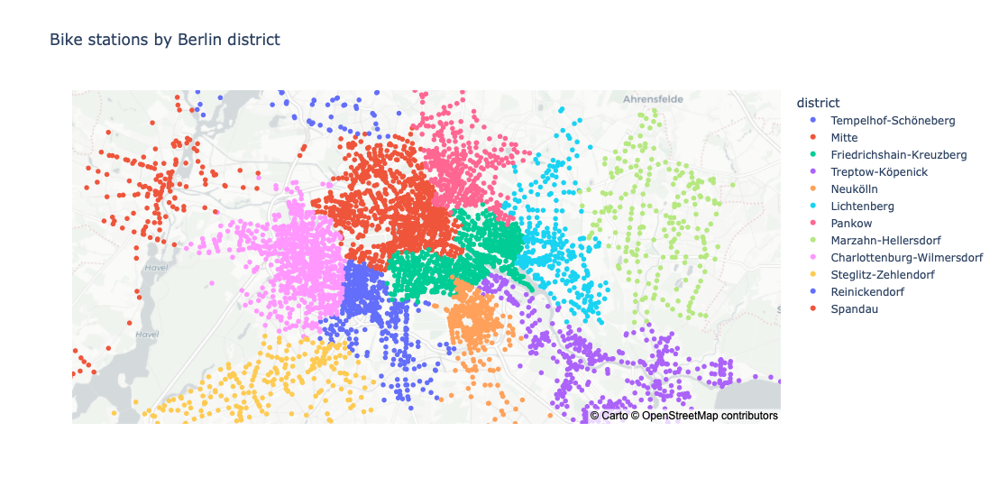

# Berlin Bike-Sharing Demand Forecasting

An end-to-end ML pipeline that predicts next-day bike-sharing demand per Berlin district to guide operational bike redistribution, ensuring bikes are available where needed.

## Problem

Nextbike and Callabike operate thousands of dockless stations across Berlin. Without demand forecasts, redistribution is reactive: bikes pile up in low-demand areas while high-demand stations run empty. This project builds a daily district-level demand forecast to support proactive rebalancing decisions.

## Pipeline overview

```
Raw station snapshots (Nextbike + Callabike)
          +  Berlin district boundaries (GeoJSON)
          +  Historical weather (Open-Meteo API)
                    │
                    ▼
          ETL pipeline (src/data/processing/)
                    │
                    ▼
     district_daily_demand.parquet
          +  weather_daily.parquet
                    │
                    ▼
        Feature engineering (src/features/)
                    │
                    ▼
     LightGBM model  ·  Optuna HPO  ·  MLflow tracking
                    │
          ┌─────────┴─────────┐
          ▼                   ▼
     FastAPI endpoint    Streamlit dashboard
          │
          ▼
   Evidently monitoring
```

Orchestrated with **Airflow**, packaged with **Docker**.

## Project status

| Stage | Status |
|---|---|
| Data collection | Done — Jan 2025 – Apr 2026 |
| EDA (`notebooks/01_eda.ipynb`) | Done |
| ETL pipeline (`src/data/processing/`) | Done |
| Feature engineering (`notebooks/02_feature_engineering.ipynb`, `src/features/`) | Done |
| Model training (`notebooks/03_training.ipynb`) | In progress |
| API (`src/api/`) | Planned |
| Monitoring (`src/monitoring/`) | Planned |
| Streamlit dashboard | Planned |
| Airflow DAGs | Planned |
| Docker / cloud deployment | Planned |

## Data

Raw data lives in `bike_data_berlin/` as monthly parquet files. Each file covers one system and one month; columns are `tag`, `nuid`, `name`, `latitude`, `longitude`, `bikes`, `free`, `timestamp`.

Station snapshots are sourced from [CityBikes](https://data.citybik.es/); weather from [Open-Meteo](https://open-meteo.com/) (free archive API, no key required).

- **Nextbike Berlin** — ~2,000–4,600 stations, snapshots every ~57 min (median)
- **Callabike Berlin** — ~470–630 stations, snapshots every ~6 h (median)
- Coverage: Jan 2025 – Apr 2026 (486 days)

**Demand estimation** — Since the data is snapshots of bikes available (not trip records), rentals are estimated as the sum of decreases in `bikes` count within each station × calendar day: `Σ max(0, bikes_prev - bikes_curr)`. This captures real rentals while discarding bike returns and rebalancing top-ups.

**District assignment** — Stations are spatially joined to Berlin's 12 Bezirke (boundaries in `configs/berlin_bezirke.geojson`). 99.8% of stations fall within a district polygon.



## Setup

```bash
# Python 3.10+ recommended
pip install -r requirements.txt
```

## Usage

**Run the ETL pipeline** (loads raw snapshots, fetches weather, writes processed parquets, saves EDA plots):

```bash
python3 -m src.data.processing.pipeline
```

Optional flags:

```bash
--no-plots               # skip saving report images
--data-dir /path/to/dir  # use a different snapshot directory (default: bike_data_berlin/)
```

Outputs written to:
- `data/processed/district_daily_demand.parquet` — date × district × rentals × active\_stations
- `data/processed/weather_daily.parquet` — daily Berlin weather (cached; re-running skips the API call)
- `reports/*.png` — EDA visualisations

**Run feature engineering** (reads processed data, writes `data/features/features.parquet`):

```bash
python3 -m src.features.build_features
```

**Open the notebooks:**

```bash
jupyter lab notebooks/01_eda.ipynb              # EDA
jupyter lab notebooks/02_feature_engineering.ipynb
jupyter lab notebooks/03_training.ipynb
```

**Run tests:**

```bash
pytest
pytest --cov=src   # with coverage report
```

## Feature engineering

Target variable: `rentals_tomorrow` (next-day demand per district).

| Group | Features |
|---|---|
| Temporal | day-of-week, month, is\_weekend, is\_holiday (Berlin state holidays) |
| Lag | rentals 1, 2, 7, 14 days ago |
| Rolling | 3/7/14-day rolling mean and std of lagged demand |
| Network | active station count per district |
| Weather | temperature, apparent temperature, precipitation, rain, snowfall, wind speed, cloud cover, humidity |

## Tech stack

| Layer | Tools |
|---|---|
| Data | pandas, pyarrow, geopandas |
| ML | LightGBM, scikit-learn, Optuna, MLflow |
| API | FastAPI, Pydantic, Uvicorn |
| Monitoring | Evidently |
| Visualisation | Streamlit, Plotly, Matplotlib |
| Orchestration | Airflow |
| Deployment | Docker |
| Weather | Open-Meteo archive API (free, no key required) |
